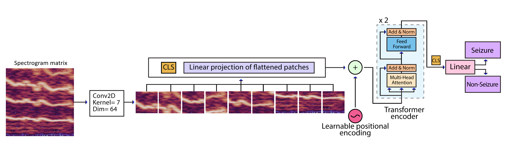

# Custom CNN-ViT & CNN for seizure detection using ECG Spectrograms (Reusable for Image Classification)

This repository contains **my custom-designed CNN-ViT and CNN architectures** for detecting seizures from ECG spectrograms.  
While designed for ECG data, the models are **fully adaptable for other image classification tasks**, making them reusable beyond this project.


CNN-ViT architecture is illustrated below:




CNN architecture is illustrated below:


This method is detailed in the following paper, where it is compared with other techniques. If you find this code useful, please consider citing the paper.


## Installation

1. Clone the repository:
```bash
git clone https://github.com/kimiarezaei/ECG-seizure-classification-using-CNN.git
cd ECG-seizure-classification-using-CNN
